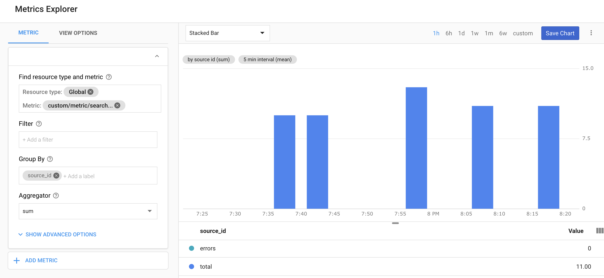

# tweet-provider

Simple Twitter search service running in Cloud Run, invoked by Cloud Scheduler, and Firestore query state. It publishes search results to Cloud PubSub and tweet throughput as custom metric to Stackdriver.


## Pre-requirements

### GCP

If you don't have one already, start by creating new project and configuring [Google Cloud SDK](https://cloud.google.com/sdk/docs/). Similarly, if you have not done so already, you will have [set up Cloud Run](https://cloud.google.com/run/docs/setup).

### Twitter

To query Twitter API you will need to obtain Twitter Consumer and OAuth tokens. Good instructions on how to obtain these are located [here](https://iag.me/socialmedia/how-to-create-a-twitter-app-in-8-easy-steps/).

Once you obtain these, export these as environment variables:

```shell
export T_CONSUMER_KEY="***"
export T_CONSUMER_SECRET="***"
export T_ACCESS_TOKEN="***"
export T_ACCESS_SECRET="***"
```

## Setup

### Build Container Image

Cloud Run runs container images. To build one we are going to use the included [Dockerfile](./Dockerfile) and submit the build job to Cloud Build using [bin/image](./bin/image) script.

> Note, you can review each one of the provided scripts for complete commands

```shell
bin/image
```

### Service Account and IAM Policies

In this example we are going to follow the [principle of least privilege](https://searchsecurity.techtarget.com/definition/principle-of-least-privilege-POLP) (POLP) to ensure our Cloud Schedule and Cloud Run servie have only the necessary rights and nothing more:

* `run.invoker` - required to execute Cloud Run service
* `pubsub.editor` - required to create and publish to Cloud PubSub
* `datastore.user` - required to create and write/read to Firestore collection
* `logging.logWriter` - required for Stackdriver logging
* `cloudtrace.agent` - required for Stackdriver tracing

To do that we will create a GCP service account and assign the necessary IAM policies and roles using [bin/account](./bin/account) script:

```shell
bin/account
```

### Cloud Run Service

Once you have configured the GCP accounts, you can deploy a new Cloud Run service and set it to run under that account using and preventing unauthenticated access [bin/service](./bin/service) script:

```shell
bin/service
```

> Notice the use of the Twitter environment variables as configuration values using the `--set-env-vars` argument.

> Since the Cloud Run services are stateless, we are going to stores the service state (last tweet ID to use as a starting point for subsequent searches) in Firestore collection (by default `twitter-query-state`).

### Cloud Schedule

The Cloud Run service will search Twitter for provided query. To invoke that service on regular bases, we are going to configure Cloud Schedule to execute that service every 10 min using [bin/schedule](./bin/schedule) script.

```shell
bin/schedule
```


You can change the search term which is used to query Twitter in the Cloud Scheduler UI after the schedule job is created or by changing the `--message-body` parameter in the above command. By default, the query is:

```json
{ "query": "serverless" }
```

## Monitoring

You can monitor the throughput of retrieved tweets in Stackdriver using the Metric Explorer



## Cleanup

To cleanup all resources created by this sample execute the [bin/cleanup](bin/cleanup) script.

```shell
bin/cleanup
```

## Disclaimer

This is my personal project and it does not represent my employer. I take no responsibility for issues caused by this code. I do my best to ensure that everything works, but if something goes wrong, my apologies is all you will get.